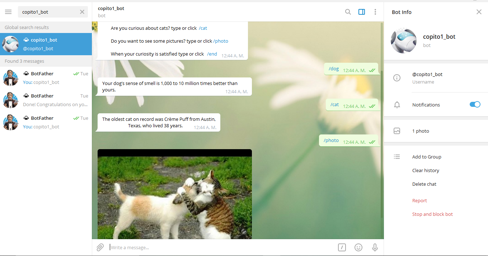

# [Telegram Bot ]

- In this project, I built a bot using the platform Telegram. This is a bot that will fill your curiosity about our furry friends (dogs and cats), it posts random curiosities about dogs and cats and also images.

 
## Setup

- Make a copy in your local enviroment(Clone the Repository)

- Open this directory in your terminal (My-telegram-bot/bin)

- To run the bot first in your terminal install the gem bundler($ gem install bundler) and then run the command bundler.

- To run the Bot only type this command in your terminal(ruby main.rb) if you are in (My-telegram-bot/bin) or (ruby bin/main.rb) if you are in (My-telegram-bot)

- To use RSpec testing framework, only run rspec in your terminal in (My-telegram-bot)

## Instructions in Telegram

- Open your telegram account and search for copito1_bot

Commands
- /start to start the conversation.
- /cat to get a random curiosity about cats.
- /dog to get a random curiosity about dogs.
- /photo to get a random imagen.
- /end to get a random goodbye.

## Bot preview

## Video preview

- https://www.loom.com/share/2eae4a8097f64dafb0e43ac9da6009a9

## Built With

- Ruby
- Colorize gem
- telegram-bot-ruby gem
- rspec gem
- Rubocop
- telegram

## Prerequisites

- Telegram account
- bundler gem

## GitHub Repo

-  https://github.com/Rocio01/My-telegram-bot/tree/master

## Author

👤 **Rocio Martinez**

- Github: [@Rocio01](https://github.com/Rocio01)
- Twitter: [@rugiada8801](https://twitter.com/rugiada8801)
- Linkedin: [zulma-martinez-5247a31a8](https://www.linkedin.com/in/zulma-martinez-5247a31a8/)

## Show your support

Give a ⭐️ if you like this project!

## Acknowledgments

- Microverse
- Ruby
- Telegram

